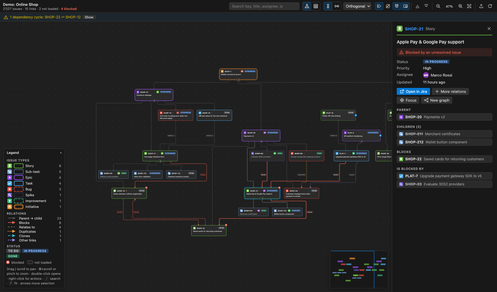
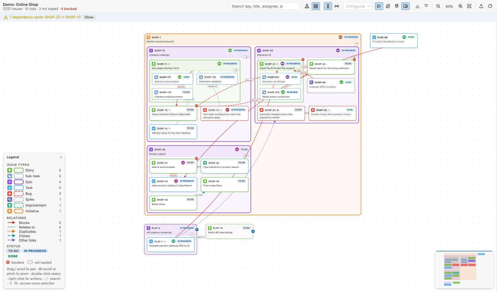

# Jira Graph for VS Code

Interactive dependency graph of Jira tickets inside VS Code, laid out with [ELK](https://eclipse.dev/elk/) (`elkjs`).

- **Hierarchy**: Initiative → Epic → Story/Task/Bug → Sub-task.
- **Cross links**: blocks, relates to, duplicates, clones, and any custom link type.




## Features

### Main-screen graph (webview panel)
- **Node = ticket.** Each node shows the key, title, status pill, priority chevrons and assignee avatar.
- **Type = border + icon.** Each issue type has its own border style and a Jira-like icon:

  | Type | Border | Icon |
  |---|---|---|
  | Initiative | orange, **double** | stacked layers |
  | Epic | purple, **thick** | lightning bolt |
  | Feature | teal, thick | flag |
  | Story | green, solid | bookmark |
  | Task | blue, solid | check |
  | Bug | red, **dashed** | dot |
  | Spike | indigo, **dotted** | magnifier |
  | Improvement | green, dashed | up arrow |
  | Incident | red, heavy | warning |
  | Sub-task | light blue, thin, **smaller card** | two squares |

  Custom types can be mapped with `jiraGraph.issueTypeStyles`.
- **Two hierarchy modes:**
  - **Tree**: parent → child edges in a layered layout.
  - **Nested**: children drawn inside their parent's container. With *"links shape layout"* off, containers are rect-packed into a compact roadmap board.
- **Link styling.** Each relation type has its own colour, dash pattern and arrowhead, plus optional labels.
- **Blocking links show the blocker's stage** (colour + line style; motion = being worked on). Stages come from `jiraGraph.statusStages`, else from Jira's status category plus the status name (*test / QA / verify / UAT / staging* → testing).
  - red solid: blocker not started;
  - orange flowing dashes: blocker in development;
  - amber slow dots: blocker in testing;
  - thin faded green: blocker done;
  - grey dashed: the blocked ticket is done although its blocker is open;
  - thick pulsing red ⚠: the blocked ticket is already in progress while its blocker hasn't started.

  The blocked badge, the details alert and the hover card's relation chips use the worst blocker's colour; the legend breaks *Blocks* down by state. Animations respect *reduce motion*.
- **Select vs details.**
  - Click selects (highlight and chains) without opening anything.
  - Hovering a ticket shows an action bar: ⓘ *Details*, ↗ *Open in Jira*, ⋯ *More*.
  - Once open, the details panel follows the selection until you close it (×, Esc, or a click on empty space).
  - Keyboard: Enter opens details, Cmd/Ctrl+Enter opens Jira, double-click still opens Jira.
- **Dependency analysis:**
  - A ⛔ badge marks issues blocked by unresolved issues.
  - **Blocks cycles** are detected (Tarjan SCC), animated, and reported in a banner.
- **Collapse and expand subtrees.** Links to hidden descendants are re-attached to the collapsed ancestor, for example `blocks ×3`. This gives an epic-level dependency view with one click (*Collapse all*).
- **Stub nodes.** Issues reached through a relation but not yet fetched appear hatched. Click **+** or double-click to load them.
- **Lenses** (toolbar, or <kbd>L</kbd> to cycle) decide what stands out: highlighted, normal or faded, plus up to two badges per ticket.
  - **Progress**: work in progress with time in status (amber ≥ 3 days, red ≥ 14), a *moved* badge for status changes in the last 48 h, and *blocks WIP* on open issues blocking active work.
  - **Completion**: done in the last 14 days, *unblocked* (every blocker done), *ready to close* (open parent, all children done), *open children* (done parent with unfinished work), and % done on containers.
  - **Planning**: active sprint highlighted; future sprint drawn dashed; backlog drawn hollow; badges for carried over (↻N), idle ≥ 30 days, and unassigned in the active sprint. Needs `jiraGraph.sprintField`, which defaults to `customfield_10020`.
- **Readable at any size**:
  - Every card has a status stripe and a tinted fill, and parents show a done / in progress / to do progress bar.
  - Zoomed out, cards turn into status-coloured tiles whose key stays readable.
- **Layout strategies** (toolbar *View*):
  - **Explicit**: every relation shapes the layout and stays drawn; nothing is packed. Full relations overview.
  - **Hybrid** (default): every relation stays explicit; only what loses no information is packed:
    - tickets with no relations at all go into a *No relations* grid;
    - childless children without relations are packed under their parent;
    - many tickets whose only relation is the same link to one hub become a framed cluster with one bundled edge (e.g. `relates to ×40`).
  - **Compact**: only *blocks* links shape the layout (within one container in nested mode). Other links are drawn on top, fan-ins and unconnected tickets are packed, and with *Links: auto* links hide above 40 until you select or hover a ticket.
- **Prerequisite and unlock chains** (tech-tree style): selecting a ticket highlights everything it transitively needs (amber) and everything it transitively unblocks (cyan), with flowing edges. The drawer shows *requires N · M open · K steps deep* and *unlocks N*.
- **Focus mode**: shows only the N-hop neighbourhood of an issue (1–3 hops).
- **Filters.** Click legend entries to hide issue types or link types. You can also hide done issues, or hide single nodes.
- **Filter** (toolbar; <kbd>/</kbd> to focus):
  - **Text** matches key, title, assignee, status, type, labels and sprint.
  - **Filter options** (funnel, with a count badge) add chips for stage, type, status, assignee, priority, sprint (incl. backlog), labels and flags (blocked, blocking, critical block, overdue, not loaded, has children, changed in the last 24 h). Values in a group are OR-ed, groups AND-ed, and every chip shows how many tickets it would match.
  - **Related to ticket** (top of the options, or right-click → *Filter to its relations…*): tickets reachable from an anchor ticket.
    - *Depth:* 1–5 hops or ∞.
    - *Direction:* both / ⬆ prerequisites (blockers, parents) / ⬇ subsequent (what it blocks, children); *relates* is always followed both ways.
    - *Via:* the relation kinds to follow (parent/child, blocks, relates, duplicates, clones, other).
    - Optionally *include sub-tasks and children* of every ticket reached.
    - Results show their hop distance and sort by *Distance*; the other chips combine with it and count within it.
  - **Modes:** *Dim others*, or *Show only matches* (their parents stay as context).
  - **Results list**, docked on the left: one line per match (type, key, stage dot and status, title, assignee, and a mark when it's outside the current view).
    - collapsible to its header, resizable by its edge (double-click resets), hideable;
    - sorted by graph order (reading order, so stepping follows the picture), key, stage, recently updated or priority.
  - **Stepping** through matches, forwards or backwards:
    - `‹ ›` in the toolbar or the list;
    - <kbd>Enter</kbd> / <kbd>Shift+Enter</kbd> in the box;
    - <kbd>F3</kbd> / <kbd>Shift+F3</kbd> or <kbd>Cmd/Ctrl+G</kbd> anywhere;
    - <kbd>↑</kbd><kbd>↓</kbd> in the list.

    Each step selects the ticket, reveals it if collapsed or filtered, and centres it. Clicking a ticket on the graph makes it the current item. Enter or ⓘ on a row opens its details. The filter and the list layout are remembered per graph.
- **Minimap**, animated relayout, pan and zoom, and fit to screen.
- **Ticket hover card** after hovering a ticket for 1 s (`jiraGraph.hoverCard.delayMs`, or turn it off with `jiraGraph.hoverCard.enabled`):
  - Shows the **description** (fetched on demand, cached until the ticket changes). It's collapsed to 4 lines (`jiraGraph.hoverCard.descriptionLines`) with *Show more*, and the details drawer shows it too. Descriptions come from Jira's rendered HTML and pass an allowlist: formatting, lists, code, quotes, tables and web links survive; images show as placeholders; scripts and other links are dropped.
  - Shows type, status, full summary, assignee, priority, time in status, sprint, due date (with overdue), points, version, labels and when it was updated.
  - Also shows its parent, a progress bar over its children, its prerequisite and unlock chains, its relations as clickable keys, and what the current lens says about it.
  - It stays open when you move into it. Moving to a neighbouring ticket switches quickly. <kbd>I</kbd> toggles it for the hovered or selected ticket; <kbd>Esc</kbd> closes it.
- **Tooltips** everywhere else, in VS Code's hover style with shortcut keys: toolbar controls (the selectors list every option, with the current one highlighted), legend rows, links, collapse and load buttons, and the live-sync status.
- **More menu** (⋯): link labels, hide done, links shape the layout, minimap, edge routing, collapse and expand all.
- **Details drawer** (resizable: drag its left edge, double-click to reset, arrow keys when focused; width remembered): status, priority, assignee, labels, parent, children and relations grouped by type, with action buttons.
- **Context menu**: open in Jira, load relations, focus, new graph from here, collapse, copy key or link, hide.
- **Keyboard:**
  - `/` filter · `F3` / `Shift+F3` next / previous match · `F` fit · `+`/`-`/`0` zoom · `L` / `Shift+L` cycle lens
  - arrows move the selection spatially
  - `Enter` details · `Cmd/Ctrl+Enter` Jira · `E` expands · `Space` collapses · `H` hides · `I` ticket card · `Esc` clears
- **Export:**
  - standalone themed **SVG**
  - **Mermaid** (paste into PRs, Confluence or Markdown)
  - visible keys, or a `key in (…)` JQL
- **Themes.** Follows the VS Code theme (dark, light, high contrast). The layout and view options are remembered per panel, and panels are restored after a restart.

### Side panel (activity-bar icon)
- **Queries**: saved JQL (stored in `jiraGraph.queries`, so it can be shared via workspace settings), recent queries, and the demo graph.
- **Graph Issues**: the hierarchy of the active graph as a tree.
  - The tree and the graph stay in sync both ways.
  - Tooltips show the relations.
  - Inline actions: open in Jira, load a stub.

### Other entry points
- `Jira Graph: Open Graph from JQL…`, with a quick pick of saved and recent queries.
- `Jira Graph: Open Graph around Issue…` pre-fills the key from the editor selection, the word under the cursor, or the git branch.
- `Jira Graph: Open Graph for Current Git Branch`, e.g. `feature/SHOP-123-guest-checkout`.
- A status bar item shows the issue count and blocked count of the active graph.

## Getting started

```bash
npm install
npm run build        # or: npm run watch
npm test             # session / layout / style unit tests
```

Press **F5** in VS Code to start an Extension Development Host. Run **Jira Graph: Open Demo Graph**, which works offline, or **Connect to Jira**:

- **Jira Cloud**: base URL, account email and an [API token](https://id.atlassian.com/manage-profile/security/api-tokens).
- **Server / Data Center**: base URL and a personal access token.

The token is stored in VS Code **SecretStorage**, never in settings.

After connecting you pick the **project** this workspace works with (`jiraGraph.project`, saved per workspace). From then on:
- the Queries panel shows the project at the top — click it to open its unresolved tickets;
- **Open Graph from JQL…** offers project presets (unresolved, all, epics, open sprints, mine, recently updated), and any typed JQL is limited to the project unless it names another one;
- **Switch Project…** rebinds the workspace.

Package: `npm run package` gives you a `.vsix`. Install it with *Extensions → … → Install from VSIX*.

## Load scope

**Open Project Graph** uses a *Sprint scope* instead of loading every ticket up to the limit. Other JQL graphs can switch to it with the **Scope** button.

1. The whole query (e.g. `project = KEY`) is indexed once. Up to `jiraGraph.scope.indexLimit` tickets are indexed, with full fields.
2. What to load is chosen locally, so changing the scope needs no new Jira query:
   - **Sprint:** active sprint (including its done tickets), plus future sprints (`jiraGraph.scope.futureSprints`). Always loaded.
   - **Context:** parents and directly linked tickets of what is loaded. Always loaded, taken from the index when possible.
   - **Backlog:** the top N by relevance (`jiraGraph.scope.backlog`, 50). Score: linked to sprint work +50 · same epic as sprint work +20 · priority up to +30 · recently updated up to +20 (fading over 14 days) · carried over +15 · due within 14 days +25.
   - **Done:** resolved within `jiraGraph.scope.doneDays` (14; 0 = none, −1 = all). Older ones load only as context, e.g. a resolved blocker.
- **Left out is not lost.**
  - Left-out children still count in progress bars.
  - Parents show a **+N** chip that loads them.
  - The hover card says why each ticket is in the graph (tier, rank, score and reasons).
  - The banner summarises the scope instead of warning; the limit warning appears only if the scope itself exceeds `jiraGraph.maxIssues`.
- **The Scope panel** has per-tier counts, a backlog slider, done steps, future sprints on/off, a budget bar against the limit, and *Whole query* to load the query as-is.
- **Live sync keeps it current:**
  - Tickets moving into a sprint (or becoming recently done) join the graph.
  - Other changes update the counts.

## Live sync

Open graphs stay current without re-fetching everything.

**When it checks** (every number is a `jiraGraph.sync.*` setting):
| Situation | Behaviour (default) |
|---|---|
| Window unfocused, or graph hidden | Paused; resuming counts as a user action |
| Focused, no interaction | Every **60 s** |
| After an action in the graph | **2 s** after the last action (debounced, never starved), then every **10 s** for a **3 min** cooldown |

**How it checks:**
- One cheap query for everything updated since the cursor: `updated >= <epoch ms> ORDER BY updated ASC, key ASC`. Epoch milliseconds are UTC and exact; date strings would use your profile time zone.
- It re-reads 5 minutes before the cursor to catch issues the search index surfaced late.
- Only issues whose `updated` changed are fetched in full.
- New issues join the graph if they match the query, are children of a loaded issue, or link to one.

**Deleted, no longer visible, or moved:** every 10 minutes (and on *Sync Now*), loaded issues are checked by numeric id.
- A missing id is removed. Jira reports deleted and no-access issues identically.
- A changed key means the issue was moved to another project; the node is renamed.
- Removed keys are remembered for 24 h, so a late search result cannot bring them back.

**On the graph:**
- Field changes redraw the card in place with a flash.
- Structural changes (added, removed, new parent or links) relayout once you stop interacting. Removed tickets fade out first, and a toast summarises the sync.
- The toolbar *live* pill shows the state and the last sync; click it to sync now.
- Try it offline: *Jira Graph: Simulate a Change in the Demo*.

## Disk cache

**Opening** a graph, including restoring it after a VS Code restart, shows the last cached state immediately (a toast says how old it is). The graph then catches up in the background: a delta query from the saved cursor, plus the deletion/move check. **Reload** always does a full load.

- **Storage:**
  - one JSON file per Jira site plus graph source, in VS Code's extension storage;
  - tickets are kept exactly as Jira returned them, together with the sync cursor, the loaded set and the load-scope index;
  - the token is never included.
- **When it's written:** debounced after loads, expansions, scope changes and syncs that changed something; while nothing changes, at most every 10 minutes (just the moved cursor).
- **Treated as a cache:** anything unusable means a normal full load. That covers:
  - a missing, corrupt or older-format file;
  - a changed field/option set (sprint field, limit, depth…);
  - a snapshot older than `jiraGraph.cache.maxAgeDays` (14).

  The cache is capped at `jiraGraph.cache.maxSizeMB` (50), dropping the least recently used graphs first. Demo graphs are never cached.
- **Control:** *Jira Graph: Clear Cache*; `jiraGraph.cache.enabled: false` turns it off and deletes it.

## Settings

| Setting | Default | Purpose |
|---|---|---|
| `jiraGraph.expandDepth` | 2 | Rounds of parents / children / links followed from the query result |
| `jiraGraph.maxIssues` | 300 | Hard cap per graph. A warning appears only when Jira reports more query results (*Showing 300 of 336…*, with *Raise limit*), or when expansion really skipped related tickets (shown as placeholders) |
| `jiraGraph.includeChildren` | true | Fetch children of epics / stories |
| `jiraGraph.epicLinkField` | – | Epic Link field id for Server/DC or legacy projects |
| `jiraGraph.storyPointsField` | – | Shown in the details drawer |
| `jiraGraph.sprintField` | customfield_10020 | Sprint field used by the Planning lens |
| `jiraGraph.hoverCard.delayMs` | 1000 | Hover time before the ticket card appears; `jiraGraph.hoverCard.enabled` turns it off |
| `jiraGraph.cache.*` | enabled, maxAgeDays 14, maxSizeMB 50 | Disk cache, see *Disk cache* |
| `jiraGraph.sync.*` | see *Live sync* | enabled, idleIntervalSeconds 60, activityDebounceSeconds 2, cooldownSeconds 180, cooldownIntervalSeconds 10, overlapSeconds 300, presenceCheckMinutes 10 |
| `jiraGraph.layout.*` | DOWN / edges / ORTHOGONAL | Defaults for new graphs |
| `jiraGraph.issueTypeStyles` | {} | `{ "Tech Debt": { "base": "task", "color": "#8B5CF6", "border": "dashed", "icon": "improvement" } }` |

## Architecture

```
src/                       extension host (Node)
  extension.ts             commands, tree views, status bar, serializer
  config.ts                settings + SecretStorage auth flow
  jira/client.ts           REST client: Cloud /rest/api/3/search/jql (token paging) and Server /rest/api/2/search
  jira/graphSession.ts     BFS expansion (links, parents, children), stubs, batching, maxIssues
  jira/demoSource.ts       offline dataset with a tiny JQL interpreter
  views/graphPanel.ts      webview panel lifecycle and message protocol
  views/*Tree.ts           side panel trees
  shared/model.ts          types shared with the webview
webview/                   browser bundle (esbuild, iife)
  layout.ts                model → ELK graph (flat / INCLUDE_CHILDREN / rectpacking) → positioned nodes & routed edges
  main.ts                  SVG renderer, interactions, drawer, legend, minimap, export
  typeStyles.ts            type → border/icon/colour mapping
```

## Roadmap

Parked ideas and open questions are tracked in [TODO.md](TODO.md).
